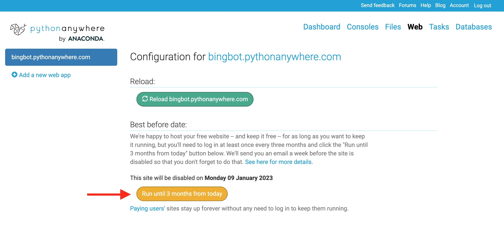
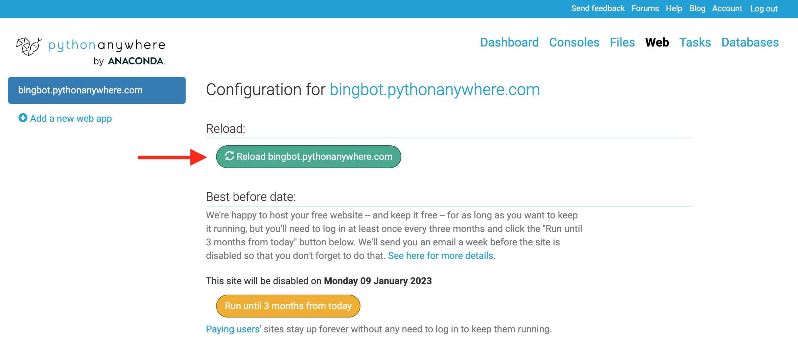

# 🦏 Bing Bot Help

- [🦏 Bing Bot Help](#-bing-bot-help)
  - [⚙️ How to turn a command or unsolicited message on or off](#️-how-to-turn-a-command-or-unsolicited-message-on-or-off)
  - [🙋 How to change the name Bing calls someone](#-how-to-change-the-name-bing-calls-someone)
  - [😨 Bing's not working! What do I do??](#-bings-not-working-what-do-i-do)
  - [📲 How to move Bing to a new chat](#-how-to-move-bing-to-a-new-chat)
- [💻 Tech Stuff for Nerds](#-tech-stuff-for-nerds)
  - [🌐 What online accounts are there?](#-what-online-accounts-are-there)
  - [🌅 Every 3 Months, Bing Needs Rejuvenated](#-every-3-months-bing-needs-rejuvenated)
  - [🪵 How to check for errors](#-how-to-check-for-errors)
  - [👾 How to update Bing's code](#-how-to-update-bings-code)
    - [Set up your development environment](#set-up-your-development-environment)
    - [Make Code Changes](#make-code-changes)
    - [Commit Code Changes](#commit-code-changes)
    - [Update the code on the server](#update-the-code-on-the-server)
  - [🏔 Environment Variables](#-environment-variables)
  - [🐍 WSGI Configuration](#-wsgi-configuration)

## ⚙️ How to turn a command or unsolicited message on or off

1. Navigate to the Settings Google Sheet at [go.osu.edu/bingsettings](https://go.osu.edu/bingsettings)
2. Check or uncheck the box next to any setting

## 🙋 How to change the name Bing calls someone

1. Navigate to the Settings Google Sheet at [go.osu.edu/bingsettings](https://go.osu.edu/bingsettings)
2. Go to the "Nicknames" tab
3. Edit the text in the "Nickname" column

## 😨 Bing's not working! What do I do??

1. Check if Bing is running by asking "Bing, are you alive?" or by visiting [this link](https://go.osu.edu/bingsettings)
    - If Bing is not running, [log in](#-what-online-accounts-are-there) to pythonanywhere.com, and [extend Bing's life for 3 more months](#-every-3-months-bing-needs-rejuvenated)
    - If that doesn't help, try [reloading the web app](#update-the-code-on-the-server)
2. Make sure the specific feature is turned on [in the settings Google Sheet](https://go.osu.edu/bingsettings)
3. [Make sure Bing is in the right GroupMe chat](#-how-to-move-bing-to-a-new-chat)
4. [Check for errors in pythonanywhere](#-how-to-check-for-errors)
    - If there is a bug in the code, consider asking a CSE friend to help [update the code](#-how-to-update-bings-code)
5. This one feature (or multiple features) never works anymore. What gives?
    - Bing relies upon many external services and APIs that are not under our control (especially pythonanywhere.com, the Google Sheets API, cron-job.org, and GroupMe). Any of these companies could choose to stop running their services at any time, and that part of Bing just wouldn't work anymore. [It's an unfortune consequence of the free and open web.](https://youtu.be/BxV14h0kFs0) All things must come to an end eventually :( It was fun while it lasted.

## 📲 How to move Bing to a new chat

To move Bing to a new chat, you need register a GroupMe bot for that chat:

1. Log into [dev.groupme.com](https://dev.groupme.com)
2. Navigate to the [Bots page](https://dev.groupme.com/bots)
3. Click ["Create Bot"](https://dev.groupme.com/bots/new)
4. Fill in the details:
   - Choose the group this bot will live in: `(Current H-Row Chat)`
   - Name: `Bing`
   - Callback URL: `https://bingbot.pythonanywhere.com`
   - Avatar URL: `https://i.imgur.com/Kr6ti95.jpg`
5. Click "Submit"
6. Copy the Bot ID, and paste it into the `GroupMe Bot ID` field in the `Tech Config` tab of the [Settings Google Sheet](https://go.osu.edu/bingsettings)
7. Click "Access Token" at the top right corner of the screen, copy it, and paste it into the `GroupMe Access Token` field in the `Tech Config` tab of the [Settings Google Sheet](https://go.osu.edu/bingsettings)
8. Delete the bot from the old chat
9. __Important:__ Log into [Bing's Gmail account](#-what-online-accounts-are-there) and [change the forwarding address](https://support.google.com/mail/answer/10957?hl=en) to your email so you will get alerts once every 3 months [when Bing's code is about to expire](#-every-3-months-bing-needs-rejuvenated), so you can prevent that from happening.

# 💻 Tech Stuff for Nerds

## 🌐 What online accounts are there?

All accounts and services are free. [Just make sure Bing doesn't die every 3 months](#-every-3-months-bing-needs-rejuvenated).

- [Google Drive / Gmail / Google Cloud Platoform](https://cloud.google.com/)
  - Settings Google Sheet
  - Recieves emails
  - Google Sheets API & credentials from GCP
- [pythonanywhere](https://www.pythonanywhere.com/user/bingbot/webapps/#tab_id_bingbot_pythonanywhere_com)
  - Hosts the Python code that runs the web server
- [GitHub](https://github.com/bing-bot)
  - To push code changes, use the `bing-bot` GitHub account. Colin (`c-o-l-i-n`) is the repo owner.
- [OpenWeather](https://home.openweathermap.org/api_keys)
  - Weather data API
- [Imgflip](https://imgflip.com/api)
  - Meme generator API
- [cron-job.org](https://cron-job.org)
  - Triggers unsolicited messages throughout the day
- [Stable Horde](https://stablehorde.net/register)
  - AI image generation API (display name: bing bot)

The username/email for all accounts is `hrow.bing.bot@gmail.com`

The password for all accounts is (all lowercase) the nickname of the band, then the serial number on H-Caliber, then an exclamation point.

## 🌅 Every 3 Months, Bing Needs Rejuvenated

In free pythonanywhere accounts, [web apps are disabled after 3 months unless you click the "extend" button](https://blog.pythonanywhere.com/129/).

pythonanywhere will email hrow.bing.bot@gmail.com the link to keep things running 1 week before she is brutally murdered.



## 🪵 How to check for errors

[pythonanywhere](https://www.pythonanywhere.com/user/bingbot/files/var/log) provides a few different log files. Scroll all the way to the bottom for the latest log entries:

- [Error log](https://www.pythonanywhere.com/user/bingbot/files/var/log/bingbot.pythonanywhere.com.error.log)
- [Server log](https://www.pythonanywhere.com/user/bingbot/files/var/log/bingbot.pythonanywhere.com.server.log)
- [Access log](https://www.pythonanywhere.com/user/bingbot/files/var/log/bingbot.pythonanywhere.com.access.log)

## 👾 How to update Bing's code

You can technically just change the [code files directly on the server](https://www.pythonanywhere.com/user/bingbot/files/home/bingbot/bing-bot/src), but the "right way" is making the changes in git:

### Set up your development environment
1. `git clone https://github.com/c-o-l-i-n/bing-bot.git`
2. `cd bing-bot`
3. [Create the Python virtual environment and install dependencies](https://docs.python.org/3/tutorial/venv.html#creating-virtual-environments)
   - `python3 -m venv bing-env`
   - `source bing-env/bin/activate`
   - `pip install -r requirements.txt`
4. `touch credentials.json` to create the Google credientials file, then copy the contents from [the server](https://www.pythonanywhere.com/user/bingbot/files/home/bingbot/bing-bot/credentials.json?edit). 
5. `touch .env` to create the `.env` file, then add all [environment variables](#-environment-variables). Copy the contents from [the server](https://www.pythonanywhere.com/user/bingbot/files/home/bingbot/bing-bot/.env?edit), but these ones need to be different:
   - `PROXY_URL=''`
   - `GOOGLE_APPLICATION_CREDENTIALS='/path/on/your/computer/to/credentials.json'`

### Make Code Changes

6. Make code changes
7. Test the code by running `python src/app.py`

### Commit Code Changes

8. `git commit` any changes to the `main` branch
9. `git push` the changes
    - When prompted to log into GitHub, use [Bing's GitHub account](#-what-online-accounts-are-there).

### Update the code on the server

10. [Log into pythonanywhere, and open a console.](https://www.pythonanywhere.com/user/bingbot/consoles/)
11. Run the commands:
    - `cd /home/bingbot/bing-bot`
    - `git pull`
    - If you get a merge error/warning while pulling, run `git reset --hard origin/main` to force pull
12. Go to the [Web](https://www.pythonanywhere.com/user/bingbot/webapps/#tab_id_bingbot_pythonanywhere_com) page
13. Click the reload button



If you have no clue what any of that means, ask a CSE major to do it.

## 🏔 Environment Variables

These environment variables are require in pythonanywhere for Bing to work properly. They are set within the [`.env` file in the project root](https://www.pythonanywhere.com/user/bingbot/files/home/bingbot/bing-bot/.env?edit). After updating and saving the `.env` file, [reload the web app](#update-the-code-on-the-server) to apply the changes.

| Key                              | Value                                                                         | Notes                                    |
| -------------------------------- | ----------------------------------------------------------------------------- | ---------------------------------------- |
| `PROXY_URL`                      | `http://proxy.server:3128`                                                    | pythoneverywhere proxy server URL        |
| `GOOGLE_APPLICATION_CREDENTIALS` | `/home/bingbot/bing-bot/credentials.json`                                     | Path to Google credentials file          |
| `SPREADSHEET_ID`                 | _([Settings Google Sheet](http://go.osu.edu/bingsettings) ID from URL)_       | docs.google.com/spreadsheets/d/`ID`/edit |
| `OPENWEATHER_API_KEY`            | _([API key from OpenWeather](https://home.openweathermap.org/api_keys))_      | Weather data API                         |
| `IMGFLIP_API_KEY`                | _(Password to [Imgflip](https://imgflip.com) account)_                        | Meme generator API                       |
| `CRON_JOB_ORG_API_KEY`           | _([API key from cron-job.org](https://console.cron-job.org/settings))_        | API to change unsolicited message times  |
| `CLARIFAI_PERSONAL_ACCESS_TOKEN` | _([PAT from Clarifai](https://portal.clarifai.com/settings/authentication))_  | Computer vision API                      |
| `OPEN_EMOJI_API_KEY`             | _([API key from Open Emoji](https://emoji-api.com/))_                         | Emoji search API                         |
| `COLLEGE_FOOTBALL_API_KEY`       | _([API key from College Football Data](https://collegefootballdata.com/key))_ | College football data                    |
| `STABLE_HORDE_API_KEY`           | _([API key from Stable Horde](https://stablehorde.net/register))_             | AI image generation API                  |

## 🐍 WSGI Configuration

Python web apps run on a [WSGI server](https://en.wikipedia.org/wiki/Web_Server_Gateway_Interface). There is a configuration file in pythonanywhere located at [/var/www/bingbot_pythonanywhere_com_wsgi.py](https://www.pythonanywhere.com/user/bingbot/files/var/www/bingbot_pythonanywhere_com_wsgi.py?edit). It loads the environment variables from the `.env` file and imports the Flask app.

If something happens to that file, replace it with this, and then [reload the web app](#update-the-code-on-the-server):

```python
# load environment variables from .env file
import os
from dotenv import load_dotenv
project_folder = os.path.expanduser('/home/bingbot/bing-bot/')
load_dotenv(os.path.join(project_folder, '.env'))

# import Flask app
import sys
path = '/home/bingbot/bing-bot/src'
if path not in sys.path:
    sys.path.append(path)
from app import app as application
```
