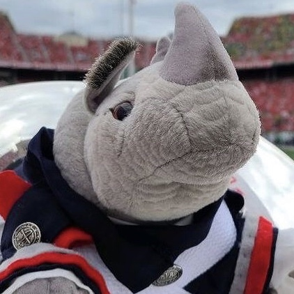

# 🦏 Bing Bot

   

## About

Bing Bot is a GroupMe chatbot for H-Row's mascot, Bing. It responds to different "commands" and sends unprompted messages throughout the day.

Bing Bot is a REST API built with the Python Flask framework, hosted on [pythonanywhere](https://www.pythonanywhere.com).

## System Architecture

There are many components/services that connect to create the Bing Bot we know and love:

- GroupMe bot registered on the owner's GroupMe account
- pythonanywhere Flask web app
- cron-job.org for triggering unsolicited messages
- "Bing Settings" Google Sheet where settings and nicknames can be changed
- Google Sheets API for reading from and writing to the spreadsheet
- OpenWeather API for getting weather data
- Imgflip API for generating memes
- Clarifai API for computer vision predictions
- Open Emoji API for searching emojis
- College Football Data API for getting college football data
- Other non-authenticated APIs for getting jokes, recipes, cat pictures, and more!

## [Help Guide](HELP.md)
